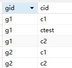

ChatHub网站设计报告

**2024 年 6 月 11 日**
# 目录
[1.	网站概述	4](#_toc169273838)

[2.	需求分析	4](#_toc169273839)

[2.1功能需求	4](#_toc169273840)

[2.2非功能需求	6](#_toc169273841)

[2.3用户需求	6](#_toc169273842)

[2.4 功能分解图	6](#_toc169273843)

[3.	设计说明	8](#_toc169273844)

[3.1总体设计架构	8](#_toc169273845)

[3.2页面设计	8](#_toc169273846)

[3.2.1页面设计原型	8](#_toc169273847)

[3.2.2 实际实现的界面	10](#_toc169273848)

[3.3 数据库设计	13](#_toc169273849)

[3.4技术选型	14](#_toc169273850)

[4.	实现过程	15](#_toc169273851)

[4.1总体开发流程	15](#_toc169273852)

[4.2前端开发	17](#_toc169273853)

[4.2.1前端webSocket实现	17](#_toc169273854)

[4.2.2聊天室信息显示的实现	18](#_toc169273855)

[4.2.3跨组件的通信方式	19](#_toc169273856)

[4.2.4同页面群切换的实现	19](#_toc169273857)

[4.2.5路由的设置	19](#_toc169273858)

[4.3后端开发	19](#_toc169273859)

[4.3.1个人对spring boot的理解	19](#_toc169273860)

[4.3.2后端的webSocket实现	19](#_toc169273861)

[4.3.3使用jdbcTemplate对数据库进行操作	19](#_toc169273862)

[4.3.4如何对前端提供服务接口	19](#_toc169273863)

[4.3.5使用JWT实现权鉴	19](#_toc169273864)

[4.4接口开发	19](#_toc169273865)

[4.4.1登录服务实现代码	19](#_toc169273866)

[4.4.2创群服务实现代码	19](#_toc169273867)

[5.	总结与展望	19](#_toc169273868)

[5.1项目完成情况	20](#_toc169273869)

[5.1.2未实现的基础功能	20](#_toc169273870)

[5.2收获与体会	20](#_toc169273871)

[5.3展望	20](#_toc169273872)

[6.	参考文献	20](#_toc169273873)

1. **网站概述**

   ChatHub 是一款面向小团体的聊天软件，主要功能有视频通讯、语音通讯、文字通讯和创建群组等功能。产品以B/S为主，但会扩展不同平台的客户端，预计有手机和电脑的专用客户端，且各端的功能保持一致，并且在实现web端后增加一个管理员界面，来监控用户在线数和访问量等。

   但目前实现的只有web端和window客户端，及简单的文本传输功能。

1. **需求分析**
## **2.1功能需求**

|**功能名称**|**输入项**|**输出项**|**功能介绍**|
| - | - | - | - |
|用户登录|邮箱、密码|登录状态|对登录用户信息进行验证|
|注册账户|邮箱、用户名、密码、确认密码。|注册状态|在登录界面，按照提示输入相关信息进行注册|
|退出登录|当前登录的用户 信息|退出状态|用户登录后可以通过退出操 作，退出当前系统的登录，此 时浏览器缓存内的token和用户id被清除|
|修改密码（未实现）|当前登录的用户 的账号、密码、用户输入的新密码、确认密码息|
修改状态信息

|对密码进行修改|
|修改基本信息（未实现）|当前登录的用户 头像、昵称 电话、邮箱地址、 个性签名|修改状态信息|用户可以在登录后通过“修 改基本信息”功能完善自己的 个人信息、或修改自己的个人 信息|
|发送消息|消息|发送状态|系统应该在发送失败时自动尝试重新发送|
|创建群组|创建人、群名、群成员|创群状态|在线用户可以选择至少一个其他在线用户来创建群聊天组。|
|消息提醒|接受消息信号|提示音/颜色变化/未读消息计数|用户在收到消息，且为未读状态时会发出提示音（web未实现提示音）和颜色变化与未读消息数|
## **2.2非功能需求**
- 主机类型

后台运行环境根据团体使用人数而定，目前暂定为 2核CPU 4G RAM Linux 系统

- 网络类型

网络通信协议为 websocket

- 存贮器容量

至少2GB的可用空间

- 运行环境

后台需要安装Java17 并通过 java -jar 命令运行jara包。

- Web端访问链接

<url:chatroom.qjlkalok.xyz>

访问后可能存在无法登录的情况，这是因为后台未开启，可通过邮箱：<1146703785@qq.com>

联系开启后台，或观看压缩包的演示视频。

该项目代码及详细的开发记录都已上传到github：

url
## **2.3用户需求**
该项目的目标用户是有私密通信要求的小团体，假设其需求如下：

1. 实时通信，有较低的延迟及较高的加密安全性
1. 通信加密
1. 群组创建与管理
1. 用户权限管理
1. 较高的实时性、并发性、可靠性
1. 较高的安全性，同时满足易转移性，方便系统更换服务器时，用户信息跟随
## **2.4 功能分解图**
图2-1 视频通讯功能分解（未实现）

图2-2 语音通讯功能分解（未实现）

图2-2 文本通讯功能分解（部分实现）

图2-3 系统功能分解（部分实现）

图2-4 视频通讯功能分解（未实现）

图2-5 用户功能分解 （部分实现）

1. **设计说明**
## **3.1总体设计架构**
该项目后端采用Spring Boot 框架，web前端采用 Vue 框架，window 端采用 Net FrameWork框架。

Spring Boot 框架：Spring Boot 是一个用于构建基于 Spring 框架的独立应用程序的框架，使用java语言，Spring Boot 为开发者提供了一系列基础设施，包括 Web 开发、安全性、事务性和数据访问等，开发者只需使用 Spring Boot 的注解和 API 即可轻松实现这些功能。

Vue 框架：Vue.js 是一款用于构建用户界面的 JavaScript 框架。它基于标准 HTML、CSS 和 JavaScript 构建，并提供了一套声明式的、组件化的编程模型。

Net FrameWork框架：Net FrameWork框NET Framework 是由 Microsoft 开发的一个软件框架，旨在支持敏捷软件开发、快速应用开发、平台独立性和网络透明化，.NET 应用程序可以使用 C#、F# 或 Visual Basic 编程语言编写。
## **3.2页面设计**
### **3.2.1页面设计原型**
聊天室主页面

登录页面

 注册界面

创群界面

### **3.2.2 实际实现的界面** 
登录界面

注册页面

聊天主界面

创群界面

课堂笔记界面

## **3.3 数据库设计**
图3-1 项目ER图

以下仅列出已实现的数据库表:

表3-1 User表

|字段名|数据类型|长度|非空|主键|字段描述|
| - | - | - | - | - | - |
|uid|Varchar|255||`	`√|用户编号，在用户创建时随机生成|
|Email|Varchar|255|√||用户邮箱，在用户创建时输入|
|username|Varchar|255|√||用户昵称，在用户创建时输入|
|password|Varchar|255|√||用户密码，在用户创建时输入|

|字段名|数据类型|长度|非空|主键|字段描述|
| - | - | - | - | - | - |
|gid|Varchar|255||`	`√|群组编号，在群组创建时随机生成|
|Ccid|Varchar|255|√||群创建人的用户编号，是来自user表的外键|
|Groupname|Varchar|255|√||群组昵称，在群组创建时输入|
|number|int|255|√||记录群组人数|

表3-2 Groupinfo表	

表3-3 GroupMember表

|字段名|数据类型|长度|非空|主键|字段描述|
| - | - | - | - | - | - |
|gid|Varchar|255|√|	|群组编号，是来自groupinfo表的外键|
|cid|Varchar|255|√||用户编号，是来自user表的外键|

该表记录群组的每个成员cid,如群组编号为g1和g2的群记录如下：
## **3.4技术选型**
ChatHub聊天室项目的后端采用spring boot框架，web前端采用Vue框架，通信协议采用websocket。首先该项目是为了锻炼个人的编程能力，及尝试了解全栈编程。

选择原因如下：、

`	`Spring Boot通过其自动配置和快速开发的能力，极大地简化了应用程序的开发流程，特别是在处理websocket这类复杂通信机制时。通过使用Spring Boot提供的websocket相关注解，使我能够专注于业务逻辑的设计，而无需过多关注底层的链接建立、消息接收和发送等配置细节。

`	`根据个人调查 ，Vue在国内前端设计领域备受欢迎，且社区也较为完善降低了作为初学者的学习成本，Vue官网有功能强大的学习空间和设计良好的学习教案，且有完善的中文教程。

前后端分离的趋势,现代Web开发越来越倾向于前后端分离的开发模式。Spring Boot和Vue的组合正好满足了这一需求，Spring Boot负责后端业务逻辑和数据处理，Vue则负责前端用户界面的展示和交互。

与基于HTTP的实时机制（如HTTP长轮询）相比，WebSocket协议使用持久连接而不是连续的HTTP请求/响应循环。WebSocket需要的带宽较少，延迟较低，减轻了客户端和服务器的负担,同时WebSocket是一项成熟的技术，得到了广泛的采用。各种编程语言和开发平台都有实现WebSocket协议的库和框架。此外，几乎所有的Web浏览器都原生支持WebSocket API。

1. **实现过程**
## **4.1总体开发流程**
本项目每完成某阶段的开发就会通过git上传到github远程仓库url,前后端各功能的总体开发过程如下：

1) 通过编写基于spring boot 的hello world 了解spring boot的MVC三层架构
1) 加入webSocket实现简单的消息传输
1) 实现一个简单的html页面，引入spring boot 的Tomcat服务器，然后打包程序，上传到伺服器测试，spring boot 的 websocket 的自带的线程管理，能否实现多对多通信。
1) 实现vue 聊天室页的顶栏（header.vue）组件，测试vue 的组件化功能
1) 完成vue 端的websocket配置（websocket通信协议的前后端连接没有跨域问题）
1) 实现聊天室页（chatroom.vue）消息接受和发送窗口组件（chatWindow.vue）
1) 实现登录页面（login.vue）
1) 伺服器配置MySql数据库完成远端连接
1) Spring boot 引入JdbcTemplete完成后端对数组库的增删改查
1) Vue 引入axios库使用axios 的代理解决vue前端连spring boot 后端的跨域问题，实现前端通过http request 对后端传输用户登录数据并接受返回的登录状态。
1) Vue 引入 router 库，完成login页到chatroom页的跳转
1) 完成注册页（signUp.vue）
1) 完成后端适配window 前端
1) 针对群组聊天修改消息收发的json格式
1) 实现window前端和web前端的群组聊天页
1) Vue前端把群组聊天页并入聊天室页（chatroom.vue）作为侧栏存在，不进行页面跳转，并通过侧栏切换聊天室。
1) 后端完善群消息的转发逻辑
1) 实现web前端的单对单通信
1) 完善后端单对单通信的转发逻辑
1) 解决 websoclet [TEXT\_FULL\_WRITING] 问题
1) 完成window端的群组创建功能
1) 完善后端的群组创建逻辑及数据库的相应操作
1) 后端websocket通过群发信息实现web端实时更新新创的群组。
1) 实现wed端标签跑马灯提醒有新消息未读
1) 优化web端的聊天室页的侧边栏和顶栏，侧边栏把单对单通信和群组通信拆分为两个列表，顶栏实现消息计数
1) 后端使用JWT完成对http request 请求接口的token 权鉴，除了login 和 signUp相关的请求，其他接口都需要用户在放送http 请求时在请求头（header）添加登录后获得的token，且token能通过后端的验证，否则不能获得服务。
1) 完成对websocket加入连接前的token权鉴，websocket 不能对请求头进行修改,所以就在websocket的protocol内加入tocken,使后端能在websocket在完成握手前，即进行握手的过程中获得前端返回的token对其进行认证，若认证不同过，则不在后端返回到前端的报文中加入token,使websocket中断连接。
1) 通过vue 的 router 组件实现路由守护，防止用户未登录前往chatroom界面和防止用户登录后返回登录界面。
1) 对login和signUp等有表单的界面实现表单校验，防止sql注入等。
1) 打包vue到伺服器，vue打包后是静态资源，不能实现跨域需要的代理。
1) 在伺服器部署vue产生的静态资源和spring boot 通过 mvn打包的jar程序，通过Nginx实现代理跳转完成跨域。
1) Web端实现退出群组功能，完成window端与部署后的后端的配对。
1) Web端把创建群组的页面并入chatroom页面，作为弹窗存在。

开发记录截图：
## **4.2前端开发**
本项目目前已开发的页面共5页，分别为：1.登录页、2.注册页、3.聊天室页、4.群创建页、5.web基础笔记页。其中群聊创建页以弹窗的形式被并入聊天室页。

Web前端的实现的核心代码主要是websocket对消息的处理，及同页面不同聊天群切换的实现代码，以下将对本人认为有意义的代码部分进行说明。
### **4.2.1前端webSocket实现**
Javascript自带webSocket，无需安装额外的库，其配置的核心代码如下（非完整代码）：

建立连接：

绑定 连接成功、连接出错、连接断开、接收消息等事件到相应的方法：

其中较为核心的的是接收消息事件对应的方法receiveMsg（）：

图4-1 接收信息事件的处理方法流程图

在图4-1中的房间的实体是对象数组的数组的元素，通过idMapArray把信息接收的目标的id与记录信息内容的对象数组的数组的元素的下标建立映像关系，之后就可以根据id把消息内容存储在相应的对象数组。

前端接收到的消息为json格式，根据code的不同，内容如下：
### **4.2.2聊天室信息显示的实现**
以下介绍把接收到的消息靠左显示、自己发的消息靠右显示的实现。

核心思想是对对象数据进行遍历，这里的对象存储了消息内容和位置标签，在遍历对象数组时根据元素对象的位置标签决定消息内容靠左还是右。

通过vue扩展的模板语法 v-for 可以实现对特定数组的遍历，通过v-if 可以实现根据位置标签有条件地渲染元素。

上述代码通过v-for遍历test对象数组的数组的元素，即遍历一个数组，该数组的对象的内容格式为：

{cid : 信息的发送者id,name : 信息的发送者的昵称, msg: 信息内容,left:位置标签}

`	`然后有两段使用 v-if 的相似代码，这两段代码通过判断tester.left分别渲染靠右的消息和靠左的消息，靠左的消息的class="message-container",靠右的消息的class="message-user"。

实际上，上述代码可以不用v-if而使用一段代码实现相同的效果，代码如下：

:class="['基础class', { '根据判断1增加的class1': 判断1，'根据判断2增加的class2': 判断2}]"
### **4.2.3跨组件的通信方式**
在vue框架内我们可以把一个.vue文件引入到另一个.vue文件内，当成一个attribute标签在html块内使用，示例如下（非完整代码）：

1. 在ChatRoom.vue文件内引入myHeader.vue和ChatWindow.vue

1. 在html块内引用

   把实现不同功能的代码封装为不同的.vue文件，并当成一个控件整体使用，可以使得代码结构更加清晰，易于理解和维护，提高了代码复用率，减少了重复代码，实现代码的封装和隔离，减少了组件之间的耦合度。

   以下将介绍在父子控件之间传输数据的两种方法。
### **4.2.3.1通过vuex**
Vuex 是 Vue.js 的状态管理模式和库。它的主要目的是在 Vue 应用中提供一个集中式的状态存储，使得组件之间的状态共享变得简单和可预测。以下是vuex的大致配置流程：

1. 用npm安装vuex后在main.js挂载store（非完整代码）：

1. 在./store 内创建index.js并设置变量及其对应的读写操作方法，以图4-1使用的cidMapTotallist为例（非完整代码）：

3\.在控件内读写cidMapGidinfo示例：

写：

读（在html块和script块内都是用this.$store.state.user.currentRoom调用）：
### **4.2.3.2pros-emit传参**

在子控件内设置props:

在父控件调用子控件的标签内传入参数：
### **4.2.4同页面群聊切换的实现**
本项目的初始设计中，用户在按下某个群的按钮时就会进行链接跳转到该群的聊天页，但是这种设计会有个网页跳转的加载时间，跳转操作的执行时间可能会因为网络波动增加，降低了用户体验，因此在项目后期把网页跳转改为页面内的组件变化。

该实现的核心思想是，不同的群聊的聊天内容用不同的对象数组存储，而这些对象数组又组成一个对象数组的数组，同时有idMapArray把群的对应id与存储该群聊天信息的对象数组在对象数组的数组中的下标绑定。

1. 在用户按下聊天群按钮时，会调用currenTab方法,按钮代码如下：

1. currenTab方法如下：

其中changeCurrentRoom是更改vuex的state中的currentRoom，currentRoom记录的现在用户所选择的群组的id，然后看4.2.2的代码，idMapArray通过currentRoom获得存储对应群组聊天内容的对象数组在对象数组的数组中的小标，通过下标访问群组对应的对象数组获取并渲染对应的聊天内容，核心语句如下：
### **4.2.5路由的设置**
在该项目中引入了router和axios来实现页面跳转、页面跳转限制和跨域，router的配置流程如下：

1. 用npm安装router后在main.js挂载store（非完整代码）：

1. 在./router 内创建index.js并设置各页面对应的跳转路径
### **4.2.5.1路由守卫**
目前路由守卫实现的跳转限制有：

1. 未登录不能进入login和signUp以外的界面

1. 登录后不能进入login和signUp界面

### **4.2.5.2 axios代理实现跨域与后端服务请求**
在Vue前端和Spring Boot后端分离开发的场景中，由于前后端分别运行在不同的服务器或端口上，所以当Vue前端尝试访问Spring Boot后端接口时，可能会因为协议、域名或端口的不同而产生跨域问题。跨域是指浏览器从一个源（源由协议、域名和端口三者组成）的页面中请求另一个源的资源时，浏览器出于安全考虑，会限制这种请求。

本项目通过axios代理vue对后端的http请求解决跨域问题，核心步骤如下：

1. 在vue.config.js配置代理规则：

1. 用axios向后端发送需要代理的http post请求时在请求路径前加上/api字段:

### **4.2.5.3部署时的路由设置**

Vue在开发完成后，打包部署时产出的是静态资源，在开发阶段由node.js支持的路由并没有包含在打包的资源内，所以在部署vue前端时，要根据伺服器的环境配置实现路由跳转，本项目部署的伺服器使用Nginx作为web服务器，Nginx（发音为“engine x”）是一个高性能的Web服务器和反向代理服务器，其反向代理的代码如下：

其中路径“/”访问的是vue产生的静态资源，路径“/api”则实现反向代理，把前端对后端的请求转发到后端端口。
## **4.3后端开发**
### **4.3.1个人对spring boot的理解**
个人认为spring boot 框架的开发分为三步，以用户离开群组的服务为例：

1. 设置服务的接口即服务的传输格式（有时还包括可视化页面的设置）：

2.实现服务的业务逻辑（在这里就是对leaveGroup方法的实现）：

3.	根据业务逻辑对数据的更改修改数据库的数据（在这就是DeletecidViaGroupMember）：
### **4.3.2后端的webSocket实现**

Spring boot 有多个websocket库，本项目引入的库如下：

后端的websocket配置步骤如下：

1. 配置webSocket配置文件：
1. 使用注解绑定 连接成功、连接出错、连接断开、接收消息等事件到相应的方法。

其中较为核心的的是接收消息事件后转发的对应的方法onMessage（），即各种发送消息方式的实现：

图4-2 后端转发事件的处理方法流程图

### **4.3.5使用JWT实现权鉴**
鉴权是指在软件运行前，通过对软件使用者进行身份认证和授权的过程，前端鉴权中，常用的认证方式包括cookie-session、Token、OAuth、HTTP Basic Authentication等。这些方式在前端和后端之间建立了安全的认证机制，确保用户合法地访问和使用软件。

JWT（JSON Web Token）是一种轻便的安全跨平台传输格式，定义了一个紧凑的自包含的方式在不同实体之间安全传输信息（JSON格式），是一种流行的跨域身份验证解决方案。
### `		`**4.3.5.1实现http请求权鉴**

1. 首先配置JWT相关依赖：

1. 配置生成token和验证token的工具类和方法（以生成token的方法为例）

1. 编写http请求拦截方法：

1. 配置http请求拦截器：

   上述步骤可以为后端配置自定义的拦截器，使后端在为前端服务前先验证是否合法用户再提供服务。

### `		`**4.3.5.2实现webSocket权鉴**
用于webSocket不能添加请求头，所以不能通过把token加在header内的方式进行鉴权，本项目对webSocket的鉴权方式是通过在webSocket的protocol内加入tocken,使后端能在websocket在完成握手前，即进行握手的过程中获得前端返回的token对其进行认证，若认证不同过，则不在后端返回到前端的报文中加入token,使websocket中断连接。

1. 前端在protocol内加入Token

1. 后端更改握手规则
## **4.4接口开发**
该项目目前后端提供的服务接口有：登录服务、注册服务、创群服务、离群服务和获取cid服务，其中只有登录服务、注册服务不需要进行权鉴。接口实现的例子看4.3.1。

1. **总结与展望**
## **5.1项目完成情况**
本项目主要实现多对多的文本通信，群聊天功能。
### **5.1.2未实现的基础功能**
本项目未实现的基础功能有：头像的上传、个人资料的编辑、创群后加群的功能。
## **5.2收获与体会**
在实现本项目的过程中本人初步掌握了web的开发，vue前端的开发，基于spring boot框架的java程序开发，及部分linux系统的操作。
## **5.3展望**
希望此后能扩展项目的功能，如加入博客，记录自己在编程时遇到的困难及解决方法，加入语音聊天和视频聊天等。

1. **参考文献**

   [1] 路由. (2024). Retrieved 14 June 2024, from https://cn.vuejs.org/guide/scaling-up/routing.html

   [2] 37手游后端团队 · . Spring Boot + JWT + Vue 实现 token 认证登录. (2024). Retrieved 14 June 2024, from https://juejin.cn/post/7147632549487968270

   [3] 用户67355988561 · . vue3中vue-router详解：基本使用，路由跳转，嵌套路由，动态路由，路由守卫. (2024). Retrieved 14 June 2024, from https://juejin.cn/post/7143890189524402183

   [4] 成就一亿技术人!. Vue 3 中安装并使用 Axios 详细步骤. (2024). Retrieved 14 June 2024, from https://blog.csdn.net/akedf/article/details/135335524

   [5] 快速开始#. (2024). Retrieved 14 June 2024, from https://element-plus.org/zh-CN/guide/quickstart.html
51
